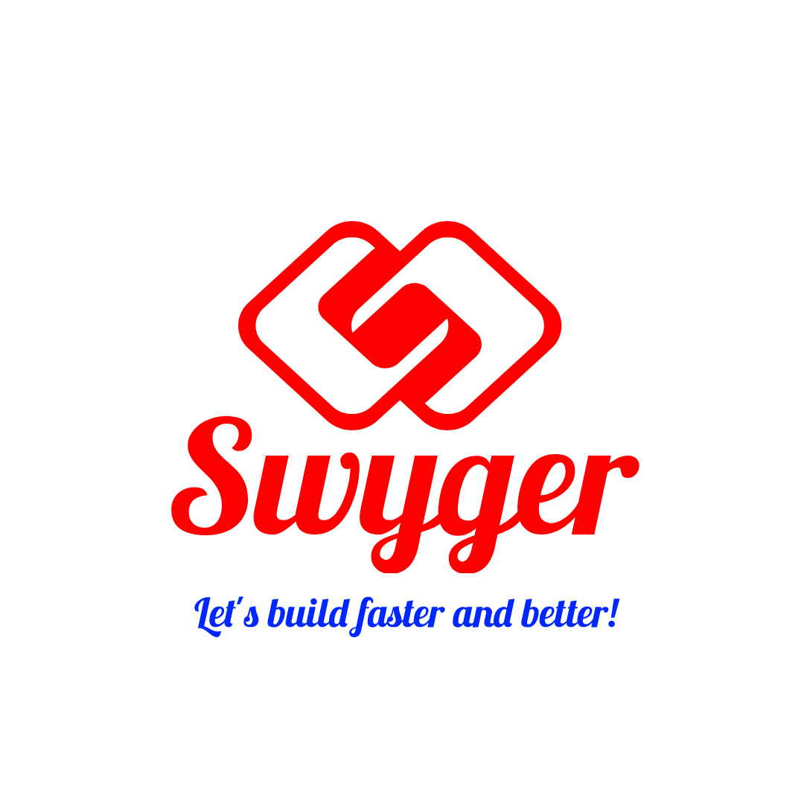

#  Swyger CLI

**Swyger CLI(Command Line Interface)** is created to help you to generate the boilerplate project (server/client...)

So it is a free and open source!!!

Note:Look for rollup option in **vite.config.js**

## Prerequisite:
- NodeJS 16+: https://nodejs.org/
- Browser: Google Chrome, Firefox, Microsoft Edge...etc (latest version)
- Terminal(command line to run the app for test)
- IDE( to modify the code source): Visual Studio, PhpStorm(recommended),sublimetext 4...etc

## Note:
This Framework, assume you already know how to use NodeJS.

## Installing Swyger CLI

``npm i @swyger/cli`` from a project

or globally ``npm i -g @swyger/client``

## Common Commands:

- ``swyger-cli -- -h``: To get th commands and option
- ``swyger-cli -- init``: To init the project
  - ``init`` command can be directly chained with:
    - ``-n your-project-name``: To create the project name

Note: In case you don't know options, just type ``swyger-cli init`` and follow the scripts.

## References

- Vite Config: https://vitejs.dev/config/
- RollupOption: https://rollupjs.org/guide/en/#big-list-of-options
- Petite-Vue: https://www.npmjs.com/package/petite-vue
- SPA-Router-Better: https://github.com/zcoding/spa-router
- SEO-META: https://www.npmjs.com/package/head-manager
- IFrame Api: https://developer.mozilla.org/en-US/docs/Web/HTML/Element/iframe

# Join US
If you have any suggestion, feature to add ...etc
- Discord(Support Team, FAQ, Chat): https://discord.gg/PPTZY5qFdC

# Contributors
- Agglomy Team :
  - Ivan Joel Sobgui
# Licence

MIT: You can use it for educational/personal/business purpose!
